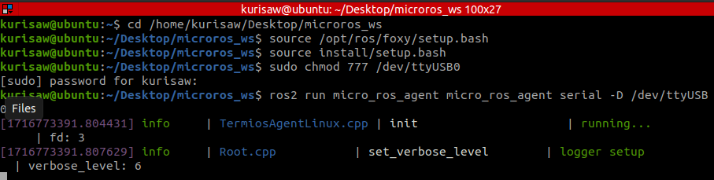
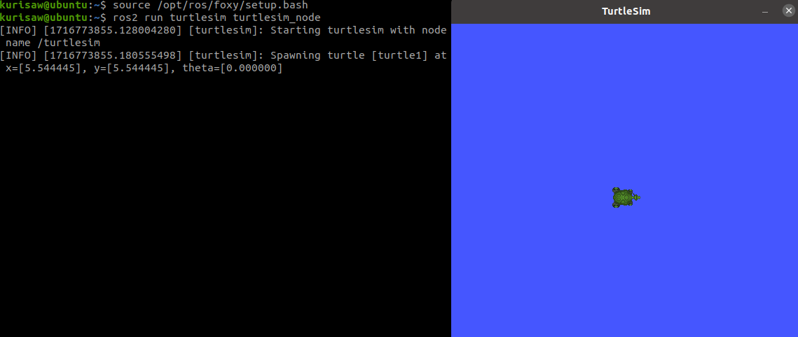
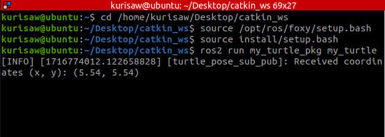
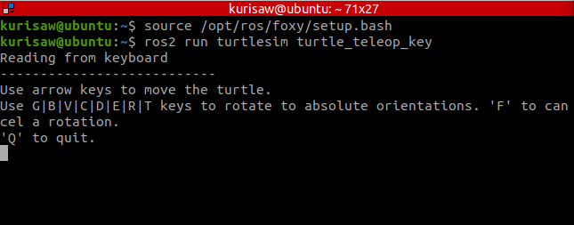
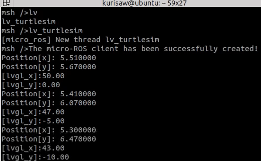

## 使用说明

### 1.启动micro-ROS代理

```bash
cd /home/kurisaw/Desktop/microros_ws
source /opt/ros/foxy/setup.bash
source install/setup.bash
sudo chmod 777 /dev/ttyUSB0
ros2 run micro_ros_agent micro_ros_agent serial -D /dev/ttyUSB0 -v6
```



### 2.启动turtlesim仿真节点

```bash
source /opt/ros/foxy/setup.bash
ros2 run turtlesim turtlesim_node
```



### 3.启动micro turtlesim发布节点

```bash
cd /home/kurisaw/Desktop/catkin_ws
source /opt/ros/foxy/setup.bash
source install/setup.bash
ros2 run my_turtle_pkg my_turtle
```



## 4.启动turtlesim key键盘控制节点

```bash
source /opt/ros/foxy/setup.bash
ros2 run turtlesim turtle_teleop_key
```



## 5.micro-ROS客户端启动

```bash
lv_turtlesim
```

